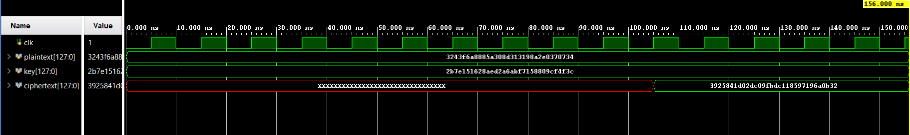

# AES-128 Pipelined (11-Cycle) Encryption in Verilog

## Overview
I took my fully working single-cycle AES-128 encryption module and upgraded it to a pipelined architecture. Instead of doing the entire encryption process purely in combinational logic, this version uses hardware registers (flip-flops) between every round. 

It has an 11-cycle latency (it takes 11 clock ticks for the first block to finish), but a throughput of 1 block per cycle. Once the pipeline is full, it outputs a fully encrypted 128-bit block every single clock edge.

---

## 1. The Files

### The Base Math Modules (Unchanged)
I reused my combinational logic blocks from the single-cycle version. They have no concept of time, which makes them perfect to drop into pipeline stages:
* `sbox.v`: The standard AES lookup table.
* `subBytes.v`: Chops the 128-bit input into bytes and runs them through the S-box.
* `shiftRows.v`: Shifts the rows of the 4x4 AES matrix.
* `mixColumns.v`: Mixes the columns using Galois Field multiplication.
* `addRoundKey.v`: Does a 128-bit XOR between the data and the round key.

### The New Pipelined Modules
* `aesRound_pipe.v`: Connects the four main steps (`subBytes` -> `shiftRows` -> `mixColumns` -> `addRoundKey`) just like before, but saves the output into a 128-bit pipeline register on the clock edge.
* `aesRoundLast_pipe.v`: The final 10th round. It explicitly skips the `mixColumns` step per the AES rules and registers the final output.
* `keyRound_pipe.v`: Replaced my old `keyExpansion.v` file. Instead of generating all 11 keys at once, this takes an input key and an `rcon` (round constant) to calculate just the *very next* round key, saving it in a flip-flop.
* `aes128_pipelined.v` (Top Module): Ties everything together. It wires the 10 data rounds and 10 key generators together so the data and keys step forward side-by-side on every clock tick.

---

## 2. Testing (`tb_aes128_pipelined.v`)

I wrote a new testbench using the official NIST standard test vector. Instead of just waiting 20ns for combinational logic to settle like in version 1, this testbench feeds the inputs and waits exactly 11 clock cycles for the data to travel through all the registers.

*Notice the red 'XXX' line for the first 11 cycles while the pipeline fills up, followed by the green line showing the correct NIST ciphertext output dropping out of the final register.*

---

## 3. Bugs & Fixes

* **Key Expansion Bottleneck:** Originally, I was going to keep my old combinational `keyExpansion.v`, but I realized that massive combinational web would drag down my max clock frequency and ruin the pipeline. I had to rewrite it into `keyRound_pipe.v` to generate keys on the fly.

---

## Conclusion
The pipelined project synthesizes properly and perfectly matches the expected AES-128 outputs. By adding registers between the stages, this architecture trades hardware area (using way more flip-flops) for a massive boost in maximum frequency and throughput.
